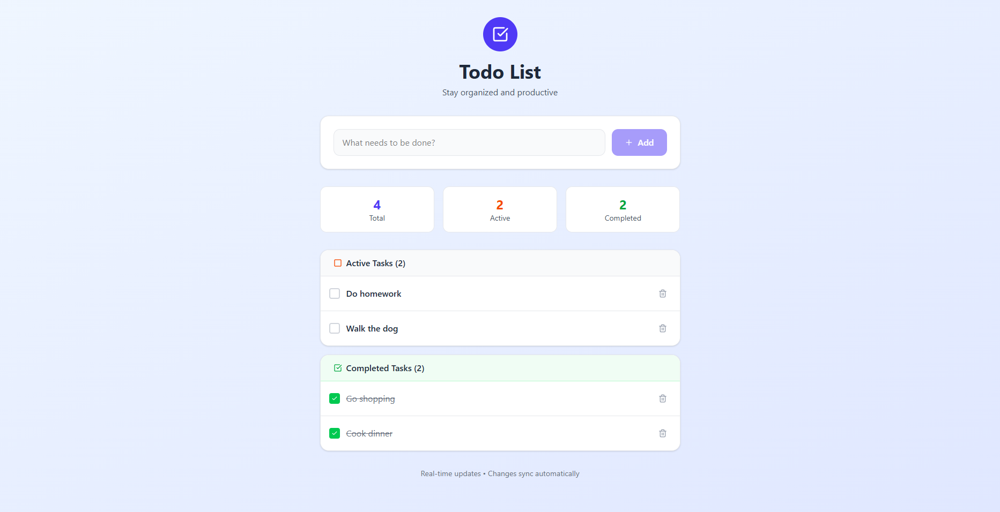

# ✅ Real-Time TODO App

> 

<div align="center">
  
  
  
  
</div>

A **collaborative, full-stack TODO application** with real-time updates built using:

- 🧠 **NestJS** (modular architecture with WebSocket + PostgreSQL + Redis)
- ⚛️ **React** + **Tailwind CSS** (modern UI with live syncing)
- 🔌 **Socket.IO** for real-time event communication
- 🐘 **PostgreSQL** for persistent data
- 🚀 **Redis Pub/Sub** for cross-service communication

---

## 📁 Project Structure

```
/
├── backend/                  # NestJS app (monorepo-style)
│   ├── src/
│   │   ├── todo/             # TODO CRUD logic
│   │   └── websocket/      # WebSocket notifications
│   └── docker-compose.yml    # Redis + Postgres services
├── frontend/                 # React app (Vite + Tailwind)
│   └── src/App.tsx           # Full-featured UI
```

---

## 🧩 Features

- ✅ Add, update, complete, and delete TODOs
- 🔄 Real-time updates across all clients via WebSocket
- 💬 Sync changes with Redis Pub/Sub
- 🔐 Scalable backend (modularized for easy microservice migration)
- 🌈 Beautiful responsive UI with Tailwind CSS
- 🧪 API-first approach ready for testing and CI/CD

---

## 🚀 Getting Started

### 1. Clone the repository

```bash
git clone https://github.com/KalanOne/TODO-RealTime.git
cd TODO-RealTime
```

### 2. Start backend (NestJS + Redis + Postgres)

```bash
cd backend
npm install
docker-compose up -d
npm run start:dev
```

### 3. Start frontend (React + Vite)

```bash
cd ../frontend
npm install
npm run dev
```

### 4. Visit the app

Open [http://localhost:5173](http://localhost:5173) in your browser 🚀

---

## ⚙️ Tech Stack

| Layer     | Tech                         |
|-----------|------------------------------|
| Frontend  | React, Vite, Tailwind CSS    |
| Backend   | NestJS, TypeORM, PostgreSQL  |
| Realtime  | Socket.IO (WebSocket)        |
| Messaging | Redis Pub/Sub                |
| Infra     | Docker, Docker Compose       |

---

## 🛠️ Future Enhancements

- 🔐 JWT-based authentication (multi-user support)
- 📱 Responsive mobile-first UI improvements
- 📊 Task analytics (charts, progress)
- ✉️ Email/Webhook integrations
- 🧩 Microservice separation for deployment

---

## 📄 License

MIT License © [Your Name](https://github.com/your-user)
